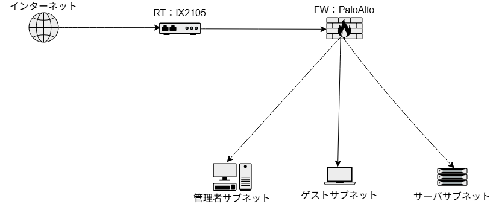
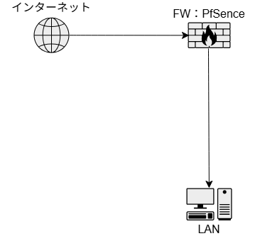

# ネットワーク概要

環境・使いたい機器に応じて適宜入れ替え、再構築を実施
その結果、ほぼ毎年構成変更をやっていた時期もあるが今は
一般的な１サブネットに落ち着いている
また全公開したくなったり、仕事の関係で検証したい機器が
出てきた場合は構成が変わるかもしれない・・・

## 2021_ネットワーク構成

- DMZ内にサーバを配置
- ルータ経由でFWに接続、LAN間のポリシー設定を省略
- 内部LANの管理者用サブネットからのみサーバサブネットにアクセス可能
- 内部LAN内にL2VPN接続サブネットを作成、実家のネットワークに接続

## 2023_ネットワーク構成

[2023_ポート接続表](docs/network-2023_port.pdf)

- FWをPaloAltoに変更
- 実家に戻ったためL2VPNサブネットは廃止
- ポート転送の関係でWAN接続にルーターを使用

## 2024_ネットワーク構成

- FWをpfsenceに変更
- 全世界公開していたWebサーバを廃止したので1サブネットに集約
- 外部公開する場合は、国別IPフィルターで日本国内のみにする

## 無線LANシステム

- 基本的にArubaのUnified APで構築
- ネットワーク構成に合わせてVLAN設定して、サブネットごとにssidを設定
- 11acまでしか対応していないので、いずれは11ax対応のAPを導入したい

## 外部アクセス用VPN

- 管理用サブネットにアクセスできるようOpenVPNで構築していた
- 今はあまり使用していないのでサーバーも削除済み